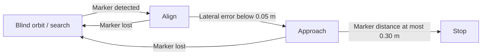

# mec_wheel — Satellite Refueling Ground Platform

ROS 2 mobile-base controller and depth processing for a terrestrial satellite refueling ground validation project.

## Project and my contribution

I am **SANGYEOP LEE (이상엽)**. I contributed to **coding and simulation** in the team project *ArUco-marker and ROS2-based Ground Validation Platform for Geostationary Satellite Refueling*, presented at ASSK 2026. This repository contains my `mec_wheel` package, whose original package metadata identifies me as maintainer. Other teammates contributed to the overall platform, including coordinate transformation and robot-arm integration.

This repository documents a laboratory prototype and preserves the existing published controller behavior. It is not on-orbit refueling flight software.

## What the package does

`mec_wheel_node` receives marker poses and target depth, then publishes mobile-base commands and status through four states:



In the preserved controller, the nominal search/alignment distance is **1.5 m**, maximum lateral search command is **0.3**, the approach threshold is **0.30 m**, and the control timer is **0.1 s**. `stopped` is published in the stop state.

`depth_center_node` processes a central ROI of a `16UC1` depth image, rejects invalid pixels, takes the median of valid values and applies a low-pass filter. Its defaults are an **80 × 60** ROI, **0.001** depth scale (mm to m), **0.10–3.00 m** valid range, at least **30** valid pixels and **0.35** filter alpha.

## ROS interfaces

| Node | Direction | Topic | Type |
|---|---|---|---|
| `mec_wheel_node` | Subscribe | `/aruco_tf` | `geometry_msgs/PoseArray` |
| `mec_wheel_node` | Subscribe | `/target_depth` | `std_msgs/Float32` |
| `mec_wheel_node` | Publish | `/cmd_vel` | `geometry_msgs/Twist` |
| `mec_wheel_node` | Publish | `/wheel_status` | `std_msgs/String` |
| `depth_center_node` | Subscribe | `/camera/camera/depth/image_rect_raw` (parameterized) | `sensor_msgs/Image` |
| `depth_center_node` | Publish | `/target_depth` (parameterized) | `std_msgs/Float32` |

The robot uses a platform-specific `Twist` convention: **`linear.z` = forward/backward**, **`linear.x` = lateral**, **`angular.y` = rotation**. A motor bridge must use the same convention; standard planar ROS `cmd_vel` axes must not be assumed.

## Layout

```text
mec_wheel/
├── launch/mec_wheel.launch.py
├── mec_wheel/
│   ├── __init__.py
│   ├── mec_wheel_node.py
│   └── depth_center_node.py
├── resource/mec_wheel
├── package.xml
├── setup.py
└── setup.cfg
```

Both existing console entry points are preserved: `mec_wheel_node` and `depth_center_node`.

## Build and inspect

The team workspace used **ROS 2 Humble** on Linux with Python. The package needs `rclpy`, `geometry_msgs`, `std_msgs`, `sensor_msgs`, NumPy, `launch` and `launch_ros`. Clone this repository under a workspace's `src` directory, then run from the workspace root:

```bash
source /opt/ros/humble/setup.bash
colcon build --packages-select mec_wheel
source install/setup.bash
ros2 pkg executables mec_wheel
```

Start only the depth-processing node:

```bash
ros2 run mec_wheel depth_center_node
```

For a camera with a different depth topic:

```bash
ros2 run mec_wheel depth_center_node --ros-args \
  -p depth_image_topic:=/your/depth/topic
```

The existing launch starts **only `mec_wheel_node` after 10 seconds**; it does not start the camera, ArUco detector or depth estimator:

```bash
ros2 launch mec_wheel mec_wheel.launch.py
```

It emits motion commands once the controller starts. For message inspection, use an isolated ROS graph with no motor bridge or actuator subscribed, and inspect `/cmd_vel` and `/wheel_status`. Physical testing requires the original calibrated platform and complete team workspace.

## External components and attribution

The larger ground platform uses external components, not redistributed here as personal code:

- [JMU-ROBOTICS-VIVA/ros2_aruco](https://github.com/JMU-ROBOTICS-VIVA/ros2_aruco) — ArUco detector (MIT).
- [IntelRealSense/realsense-ros](https://github.com/IntelRealSense/realsense-ros) — camera driver.
- Team `aruco_tf` — marker-coordinate transformation feeding `/aruco_tf`.
- Team I2C/motor bridge — consumes the platform-specific `/cmd_vel`.
- Teammate arm/MoveIt integration, using [pymoveit2](https://github.com/AndrejOrsula/pymoveit2), consumes the stop/status workflow outside this package.

The controller can build independently; the full experiment requires these sensor and hardware components.

## Current prototype limits and validation

The runtime source is preserved from the repository's existing revision `ef3b5d5` so portfolio cleanup does not change physical robot behavior. Python syntax, package XML, resource files and both console entry points were checked. A ROS 2 build or physical experiment was not run in the Windows preparation environment.

Known points for further development: callbacks do not reject stale marker/depth samples; the blind-orbit depth correction currently reads `marker_z` rather than `depth_distance`; control gains, distances and axis conventions are hard-coded for the prototype. These limits are documented rather than silently changed during repository organization.

한글 요약: 위성 재급유 지상 검증 프로젝트에서 담당한 메카넘 휠 제어와 Depth 센서 처리 코드입니다. 기존 실행 동작과 ROS 패키지 구조는 유지하고, 담당 범위·토픽·빌드 방법·현재 한계를 정리했습니다. 조원과 외부 라이브러리의 코드는 별도 구성요소로 구분했습니다.

## License

The existing package declares **Apache-2.0**. That declaration is preserved and the standard license text is supplied in [LICENSE](LICENSE). Personal student email metadata is replaced with a non-contact placeholder; the maintainer name is retained. Upstream components retain their own licenses.
